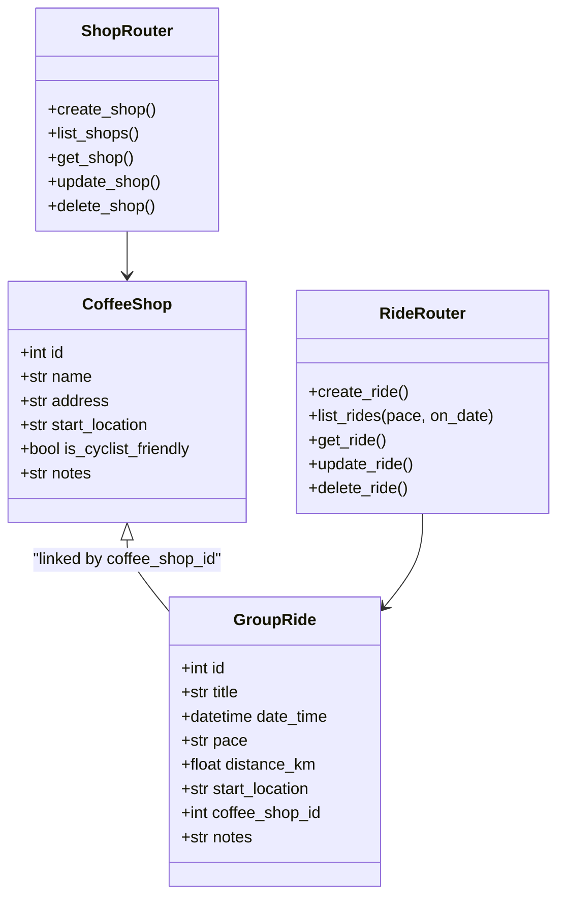

# Ride Planner API (Assignment 1 – SD&D)

A minimal **FastAPI** application that manages **cycling group rides** and **coffee shops**.  
It uses REST API design, database persistence with SQLite, and clean modular structure.

---

## Prerequisites
- Python **3.10+**
- pip
- (Recommended) VS Code + REST Client extension for `requests.http`

---

## Setup & Run

```bash
# 1) Create and activate virtual environment
python3 -m venv .venv
source .venv/bin/activate   # macOS/Linux
# .venv\Scripts\activate  # Windows PowerShell

# 2) Install dependencies
pip install -r requirements.txt

# 3) Run the server
uvicorn app.main:app --reload
```
The API will be available at: http://127.0.0.1:8000  
Interactive docs: http://127.0.0.1:8000/docs

**Port already in use?** Run on another port:
```bash
uvicorn app.main:app --reload --port 8001
```

---

## Project Structure

```text
assignment1-sdd/
│── app/
│   ├── __init__.py
│   ├── main.py          # FastAPI entrypoint
│   ├── database.py      # Database setup (SQLite + SQLModel engine)
│   ├── models.py        # ORM models (CoffeeShop, GroupRide)
│   ├── schemas.py       # Pydantic schemas for validation
│   └── routers/
│       ├── shops.py     # CoffeeShop endpoints
│       └── rides.py     # GroupRide endpoints
│── tests/
│   ├── conftest.py      # Fresh DB per run, TestClient fixture
│   ├── test_shops.py    # CoffeeShop tests
│   └── test_rides.py    # GroupRide tests
│── pytest.ini           # Points pytest at tests/
│── requests.http        # Example HTTP requests
│── requirements.txt     # Dependencies
│── README.md            # Documentation
│── REPORT.md            # SDLC choice and DevOps reflection
│── rideplanner.sqlite3  # SQLite database (created on first run)
```

---

## Architecture Design



---

## API Endpoints

### Coffee Shops
- `POST /shops` → Create a new coffee shop, **201 Created**
- `GET /shops` → List all coffee shops
- `GET /shops/{id}` → Get details of a specific coffee shop, **404** if not found
- `PUT /shops/{id}` → Update a coffee shop, **404** if not found
- `DELETE /shops/{id}` → Delete a coffee shop, **404** if not found

### Group Rides
- `POST /rides` → Create a new group ride, **201 Created**, **400** if `coffee_shop_id` is invalid
- `GET /rides` → List all group rides  
  Filters: `pace`, `on_date=YYYY-MM-DD` (implemented as a start-of-day to next-day time window)
- `GET /rides/{id}` → Get ride details, **404** if not found
- `PUT /rides/{id}` → Update a ride, **404** if not found, **400** if `coffee_shop_id` is invalid
- `DELETE /rides/{id}` → Delete a ride, **404** if not found

**Notes:** pace is free text so I can write what cyclists actually say (easy, moderate, fast).  
`start_location` is a landmark or meeting spot in plain language.

---

## Example Requests

Use the `requests.http` file with VS Code’s REST Client, or curl. Example snippets are included there for: health check, shop CRUD, ride CRUD, filters.

---

## Report

See **REPORT.md** for the **SDLC choice and justification**, and the **DevOps reflection**.  
If your course requires a single-PDF submission, export REPORT.md (with appendices) to A4 PDF.

---

## Testing & Coverage

This project ships with backend unit and integration tests for the FastAPI routers.

### How to run
```bash
# from the project root, with the venv active
PYTHONPATH=. pytest
```

### With coverage, target ≥ 90%
```bash
PYTHONPATH=. pytest --cov=app --cov-report=term-missing --cov-fail-under=90
```

### What is covered
- CoffeeShop CRUD: create, list, get, update, delete, not found after delete
- GroupRide CRUD: create, list, get, update, delete
- Validation: `coffee_shop_id` returns **400** with a clear error message when invalid
- Filtering: `GET /rides?on_date=YYYY-MM-DD` uses a reliable **day-bounded** range for SQLite

### Layout
```text
tests/
  conftest.py        # fresh SQLite DB per run, engine disposed between tests
  test_shops.py      # CoffeeShop tests
  test_rides.py      # GroupRide tests
pytest.ini           # points pytest at tests/
```

### Dev test dependencies
Add to `requirements.txt` if not present:
```
pytest
pytest-cov
httpx
```

### Troubleshooting
- `ModuleNotFoundError: No module named 'app'` → run tests with `PYTHONPATH=. pytest`
- `sqlite3.OperationalError: attempt to write a readonly database` → ensure the engine is disposed in the fixture, remove the DB file, then re-run:
  ```bash
  rm -f rideplanner.sqlite3
  PYTHONPATH=. pytest
  ```

---
